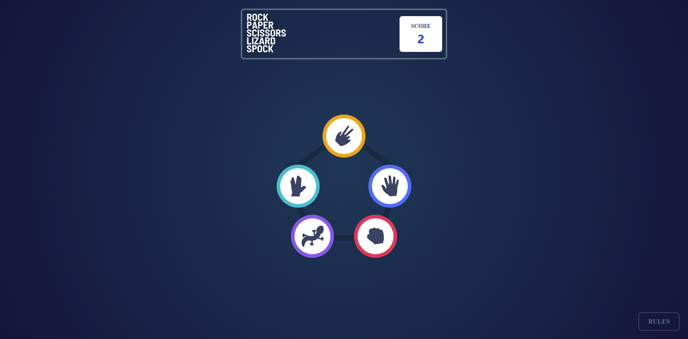
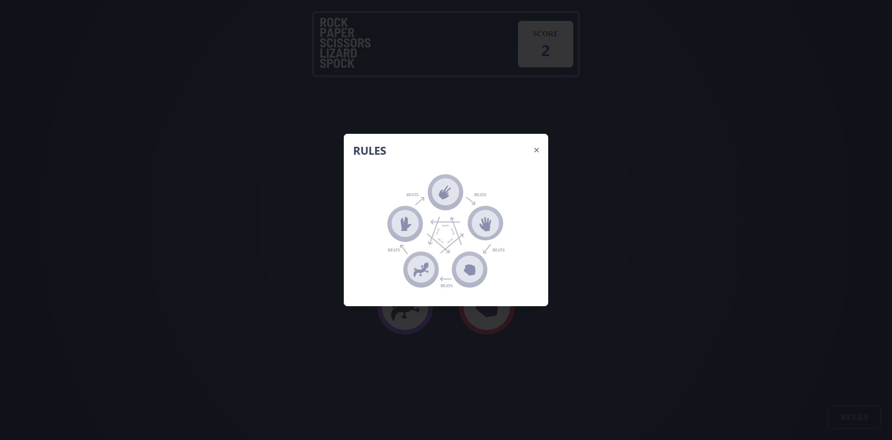
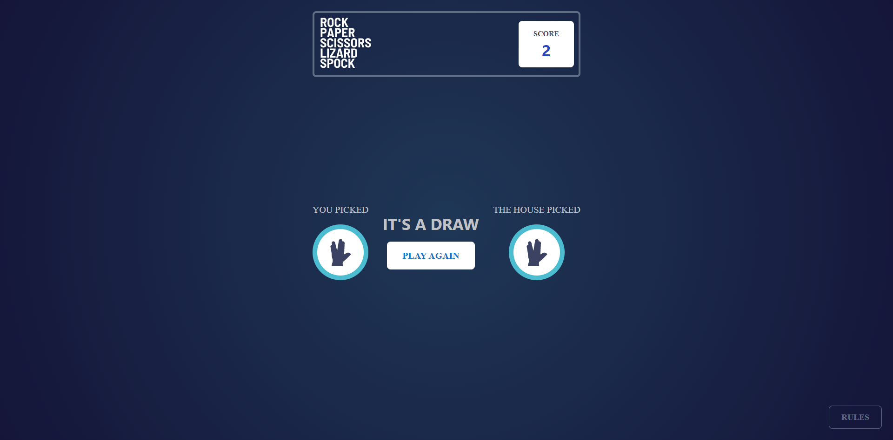
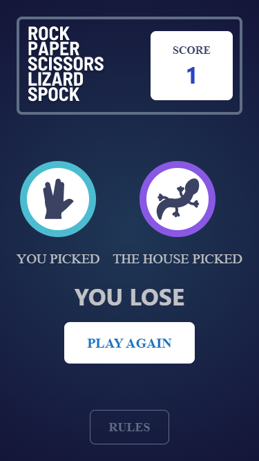
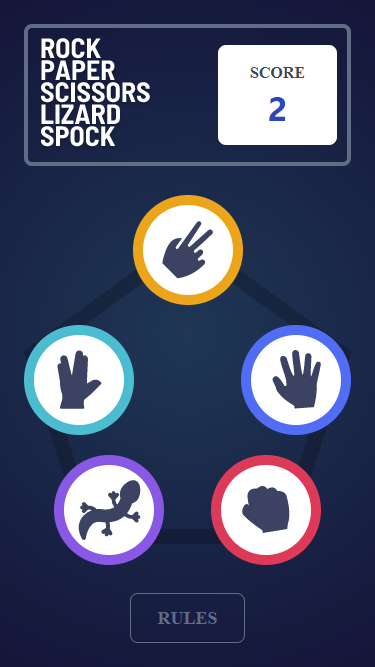
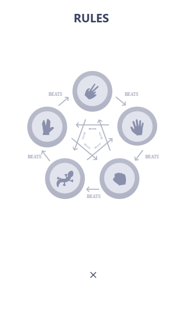
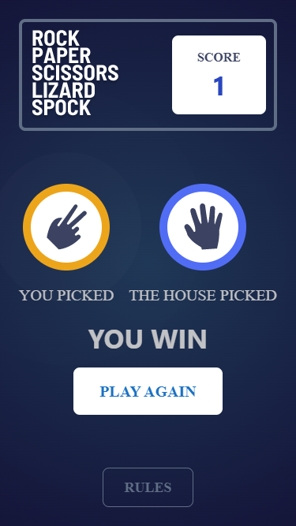

# Rock, Paper, Scissors, Lixard and Spock

This is a solution to the [Rock, Paper, Scissors challenge on Frontend Mentor](https://www.frontendmentor.io/challenges/rock-paper-scissors-game-pTgwgvgH). Frontend Mentor challenges help you improve your coding skills by building realistic projects.

## Table of contents

- [Overview](#overview)
  - [The challenge](#the-challenge)
  - [Screenshot](#screenshot)
  - [Links](#links)
- [My process](#my-process)
  - [Built with](#built-with)
  - [What I learned](#what-i-learned)
  - [Continued development](#continued-development)
- [Author](#author)

## Overview

### The challenge

User are able to:

- View the optimal layout for the game depending on their device's screen size
- Maintain the state of the score after refreshing the browser
- Play Rock, Paper, Scissors, Lizard, Spock against the computer

### Screenshot

### Links

- Solution URL: [rock-paper-scissors](https://github.com/Dalcio/rock-paper-scissors)
- Live Site URL: [Rock Paper Scissors](https://rock-paper-scissors-flax-eight.vercel.app)

## My process

### Built with

- Typescript - JS superset
- [React](https://reactjs.org/) - JS library
- [Next.js](https://nextjs.org/) - React framework
- [Mantine UI](https://mantine.dev) - For styles

### Continued development

I pretend to implement Multiplayer,.

## Author

- Website - [Dálcio Garcia](https://dalciogarcia.vercel.app)
- Linkedin - [dalcio](https://linkedin.com/in/dalcio)
- Github - [@dalcio](https://github.com/dalcio)
